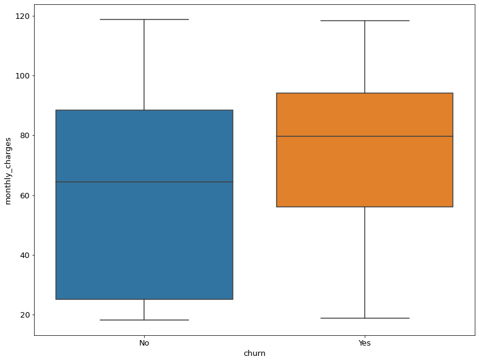

# Why are our customers churning?.

To answer this question, our data science team contructed a model to predict customer churn using classification techniques.

# Deliverables

### The team was asked to provide:
> - A detailed report answering the question, _"Why are our customers churning"?_ which includes analysis depicting who is most likely to churn along with insight on why they may be choosing to do so
> - A .csv file with uniquely identifiable customer id, the probability and predictioin of churn using our best model
> - Slide deck describing the metrics of the chosen model along with a presentation to explain how we arrived at our decision
> - `telco_churn.customers.py` file that will take in a new dataset, (in the exact same form of the one you acquired from telco_churn.customers) and perform all the transformations necessary to run the model we have developed on this new dataset to provide probabilities and predictions.

# Executive Summary
### Key Takeaways

- The most important features for determining customer churn include:
> 1. Contract type 
> 2. Tenure of three months or less
> 3. Monthly charges
> 4. Automatic payment
> 5. Senior Citizen status

- The question about why our customers are churning is answered in two parts: Who is most likely to churn and what is it about that group that may be motivating them to churn
- Essentially, customers with a month-to-month, not using automatic payments tend to churn within the first three months and many of them are classifed as senior citizens. 
- A look at thier monthly charges revealed, that they pay on average 13 dollars more per month than customers that did not churn

#### _Further analysis recommended:_

- Determine which services those customers are using at a higher rate
- Determine cost of losing customers

# Data Dictionary
|          Feature         |    Count/data type    | Description                                                                                                                                                                                                |
|:------------------------:|:---------------------:|------------------------------------------------------------------------------------------------------------------------------------------------------------------------------------------------------------|
| customer_id              | 7043 non-null object  | Unique identifier of each customer at the company                                                                                                                                                          |
| gender                   | 7043non-null int64    | Gender of the customer. 0 indicates female,1 indicates male                                                                                                                                                |
| senior_citizen           | 7043 non-null int64   | Indicates if the customer is classified as a senior citizen. 1 indicates is a senior citizen, 0 indicates is not a senior citizen                                                                          |
| partner                  | 7043 non-null int64   | Indicates if the customer has a partner. 1 indicates has a partner, 0 indicates does not have a partner                                                                                                    |
| dependents               | 7043 non-null int64   | Indicates if the customer has dependents. 1 indicates has dependents, 0 indicates does not have dependents                                                                                                 |
| tenure                   | 7043 non-null int64   | Indicates the number of months the customer has being paying for services at the company                                                                                                                   |
| monthly_charges          | 7043 non-null float64 | Indicates how much the customer pays per month                                                                                                                                                             |
| total_charges            | 7043 non-null float64 | Indicates how much the customer has paid to date since becoming a customer                                                                                                                                 |
| phone_service            | 7043 non-null int64   | Indicates if the customer pays for phone service. 1 indicates does pay for phone service, 0 indicates does pay for phone service                                                                           |
| multiple_lines           | 7043 non-null int64   | Indicates if the customer pays for multiple phone lines. 2 indicates does pay for multiple phone lines, 1 indicates does pay for multiple lines, 0 indicates has no phone service                          |
| online_security          | 7043 non-null int64   | Indicates if the customer pays for online security. 2 indicates does pay for online security, 1 indicates does not pay for online security, 0 indicates does not have internet service                     |
| online_backup            | 7043 non-null int64   | Indicates if the customer pays for online backup service. 2 indicates does pay for online backup service, 1 indicates does not pay for online backup, 0 indicates does not have internet service           |
| device_protection        | 7043 non-null int64   | Indicates if the customer pays for device protection (router?). 2 indicates does not pay for device protection, 1 indicates does not pay for device protection, 0 indicates does not have internet service |
| tech_support             | 7043 non-null int64   | Indicates if the customer pays for technical support. 2 indicates does pay for online technical support, 1 indicates does not pay for online technical support 0 indicates does not have internet service  |
| streaming_tv             | 7043 non-null int64   | Indicates if the customer pays to stream tv online. 2 indicates does pay to stream tv online, 1 indicates does not pay to stream tv online, 0 indicates does not have internet service                     |
| streaming_movies         | 7043 non-null int64   | Indicates if the customer pays to stream movies online. 2 indicates does pay to stream movies online, 1 indicates does not pay to stream movies online, 0 indicates does not have internet service         |
| paperless_billing        | 7043non-null int64    | Indicates if the customer uses paperless billing. 1 indicates they do use paperless billing, 0 indicates they do not use paperless billing                                                                 |
| contract_type_id         | 7043 non-null int64   | Indicates the type of contract the customer has signed. 1 indicates month-to-month contract, 2 indicates one year contract, 3 indicates two year contract                                                  |
| payment_type_id          | 7043 non-null int64   | Indicates the type of payment method the customer uses. 1 indicates electronic check, 2 indicates mailed check, 3 indicates bank transfer (automatic), 4 indicates credit card (automatic)                 |
| internet_service_type_id | 7043 non-null int64   | Indicates the type of internet service the customer has, 1 is DSL, 2 is fiber optic, 3 is none                                                                                                             |
| churn                    | 7043 non-null int64   | Indicates if the customer stopped using the company's product or service. 1 indicates churn, 2 indicates no churn                                                                                          |
| automatic_payment        | 7043 non-null bool    | Indicates if the customer participates in an automatic form of payment. True indicates they use a form of automatic payment, False indicates they do not                                                   |
| monthly_charges_scaled   | 7043 non-null float64 | Monthly charges column scaled using the MinMax Scaler from Sklearn                                                                                                                                         |
| tenure_3_or_less         | 7043 non-null bool    | Indicates if the customer has been with the company for 3 months or less                                                                                                                                   |

# Pipeline

## Aquisition

- The data can be pulled in from a function called `get_telco_data` which runs a SQL query of the telco_churn database. The results are comprised of features from four tables:
> - contract_types
>- internet_service_types
>- customers
>- payment_types
- The results were then converted to a pandas dataframe. 
- The function is stored in acuire.py and imported to this notebook

## Preparation
The following changes are applied to the dataframe via the wrangle_telco function store in the wrangle.py file:
>- Total_charges column is based on the tenure and monthly_charges column. There were several null values in the tenure column and we assumed that meant the customer was at the company for less than one month but likely would still be charged for at least one month of services. So the nulls in tenure were filled with a 1 and the value for monthly charges were set to that of other customers with a tenure of 1.
>- A boolean column of automatic payment types was added that indicates if the customer uses an automatic form of payment
>- A column of monthly_charges_scaled was added for the purposes of vizualization and modeling
>- Another boolean columnn of tenure_3_or_less indicates if the customer has been a part of the company for 3 or less months
A description of the rest of the features can be found in the data dictionary in the README.md>
### Hypothesis testing

#### First Hypothesis
- $H_0$: Tenure has no effect on churn rate
- $H_a$: Tenure does have an effect on churn rate
- alpha ($\alpha$): 1 - confidence level (95% confidence level -> $\alpha = .05$)

#### Second Hypothesis

- $H_0$: people who churn are paying more per month than those who arent
- $H_a$: people who churn are paying the same or less than those who dont churn
- alpha ($\alpha$): 1 - confidence level (95% confidence level -> $\alpha = .05$)

> A t value of 16.965 and pvalu of 0.37e-60 indicates the likelyhood of customers not churning due to paying more per month is extremely small. 

## Exploration

During this section, the team identified patterns in the data which may help to isolate which features were most helpful in predicting churn.

- The visualizations generated in this section aim to show the relationships between churning and:
> 1. Contract type 
> 2. Tenure of three months or less
> 3. Monthly charges
> 4. Automatic payment
> 5. Senior Citizen status

Below is a figure which most directly answers the question __why__ people are churning:

It appears that people who churn pay on average more than people who do not churn. Customers who believe they are not recieving enough value for their dollars may be motivated to churn.
## Modeling
The modeling stage involved created several versions of the following 4 models using Sklearn:
>- Logistic Regression: "Technically a regression algorithm used for predicting discrete outcomes (binomial and multinomial).The output is a value between 0 and 1 that represents the probability of one class over the other"
>- "Decision Tree: A sequence of rules that can be used to classify 2 or more classes. Each node represents a single input variable (x) and a split point or class of that variable. The leaf nodes of the tree contain an output variable (y) which is used to make a prediction. Predictions are made by walking the splits of the tree until arriving at a leaf node and output the class value at that leaf node."
>- "Random Forest: A series of decision trees that based on multiple samples of training data. Random forest decision trees are then created so that rather than selecting optimal split points, suboptimal splits are made by introducing randomness. The models created for each sample of the data are therefore more different than they otherwise would be, but still accurate in their unique and different ways. Combining their predictions results in a better estimate of the true underlying output value." 
>- "K Nearest Neighbors: Makes predictions based on how close a new data point is to known data points.Predictions are made for a new data point by searching through the entire training set for the K most similar instances (the neighbors) and summarizing the output variable for those K instances."

>> __Citation for descriptions:__
>> - [Logistic Regression](https://ds.codeup.com/7-classification/6.1-logistic-regression/#visualize-model)
>> - [Decision Tree](https://ds.codeup.com/7-classification/6.2-decision-trees/)
>> - [Random Forest](https://ds.codeup.com/7-classification/6.3-random-forests/)
>> - [K Nearest Neighbors](https://ds.codeup.com/7-classification/6.4-knn/)

The two hyperparameters that were adusted were:
- The number of neighbors in KNearestNeighbors (set to 7)
- The max_depth of the Decision Tree (set to 3)

## Evaluation
To start, a baseline model was created by simply predicting the positive case (no churn) every time. 

- Each model has been evaluated based on accuracy, precisioin and recall. 
- For the purposes of this project, we chose the model that produced the highest accuracy as we wanted to maximize predicting both the customers who are most likely to churn and those least likely to churn. 

Based on that metric, the best model generated was Logit Classifier.
- This model had the highest accuracy percentage at 78% meaning out of every 100 customers, this model will corectly predict who will churn and who will not for 78 customers.

# Conclusion

- The customers most likely to churn are senior citizens on the month-to-month plan who are not enrolled in automatic payments. 
- Based on the analysis done in this project, they are most likely churning due to higher costs per month than their counterparts on other contract types. 

# Techinical Skills

- Python (including libraries)
- SQL
- Hypothesis testing
- Logistic Regression, Decision Tree, Random Forest, K Nearest Neighbors models
- Canva

To view the presentation, please [click here](https://www.canva.com/design/DAD6kLeGec8/JUm9G7dao7PNw8tl8H3pqA/view?utm_content=DAD6kLeGec8&utm_campaign=designshare&utm_medium=link&utm_source=sharebutton)

#### Note: To reproduce this you will need your own env.py file generating the URL to access the SQL server. All other modules and functions are included in the repository.